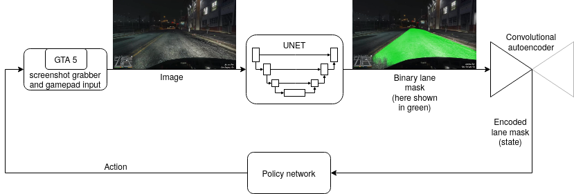

# SAC playing GTA 5

  
   
    <em>Video of the policy network, steering the car (actual in-game footage, steered by policy network).</em>

You can also check out a longer version [**here**](https://youtu.be/EqImSp_-Bi4).

## 1. How it works

  
   
    <em>Overview of the blocks used to steer the car</em>

### 1.1. GTA 5 input/output

A python script is running next to GTA 5 in the background and is constantly making screenshots of the game. The image resolution is then reduced to 360x160 pixels and passed to the UNET. The script is receiving actions from the policy network, which are then used to move the stick axis of a virtual gamepad, which is used to steer the car. The reason for this low resolution is the lack of computational power (I just have a single 1070ti).

### 1.2. UNET

  
   
    <em>Input of the UNET on the left side, prediction overlayed on the right.</em>

Above you can see an example video sequence. On the right you can see the input video and on the right the prediction of the UNET overlayed. Only the ego lane (green) is used here, the other part is discarded.

For higher quality, please refer to Youtube: [**Sequence 1**](https://youtu.be/7CglopJUJ-s) and [**Sequence 2**](https://youtu.be/CmNyb3Eu1HM)

### 1.3. Convolutional autoencoder and policy network

I have a whole repository dealing with this part, so please check it out [**here**](https://github.com/MatthiasSchinzel/Soft-Actor-Critic-For-Simple-Car-Game)

## 2. Train of the individual parts

Every individual network was trained independently (divide and conquer), which made it much easier to debug.

* **UNET**: trained on [**BDD100K**](https://bair.berkeley.edu/blog/2018/05/30/bdd/). Unfortunately there is no GTA dataset for lane detection. Therefore we have a domain gap already quite early in our stage, reducing performance. For the encoder I used a Resnet34.
* **Autoencoder/SAC**: Trained with my simple car game. For more details please click [**here**](https://github.com/MatthiasSchinzel/Soft-Actor-Critic-For-Simple-Car-Game)

## 3. Does it even work?

Before I describe how good/bad it works just have a look at actual in-game  [**footage**](https://youtu.be/EqImSp_-Bi4), steered by policy network.

Yes and no. What is working is that it is steering okay. However, I just have a single 1070ti, which is running the game and all the networks at once. Hence if it is getting hectic in the game, the policy net is too slow to throw out actions (2 actions ever second). Also the domain gap between real world and GTA5 is there at an early stage of the pipeline, affecting all following steps. Nevertheless it is possible to go from one place to another, just go a little bit slower, so the policy network can react. Also the policy network does not know how to interact with other cars.

## Authors

* [**Matthias Schinzel**](https://github.com/MatthiasSchinzel)

## License

No license yet

## Acknowledgments
* [**Check out BDD100K!**](https://bair.berkeley.edu/blog/2018/05/30/bdd/) Impressive dataset.
* Also thanks to [**segmentation models**](https://github.com/qubvel/segmentation_models), I used this UNET implementation
